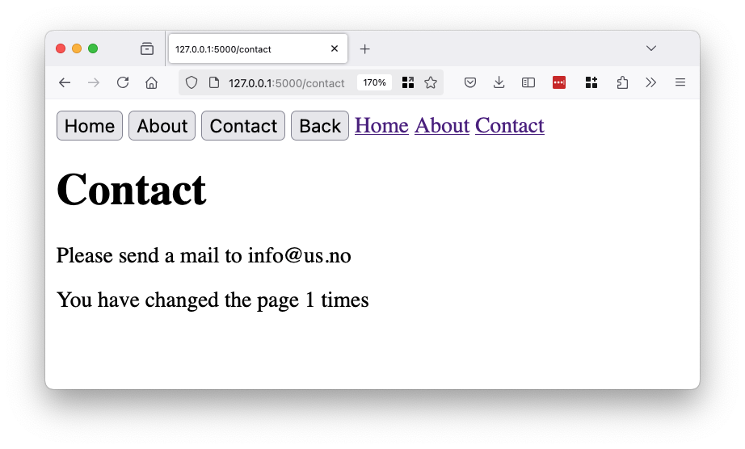
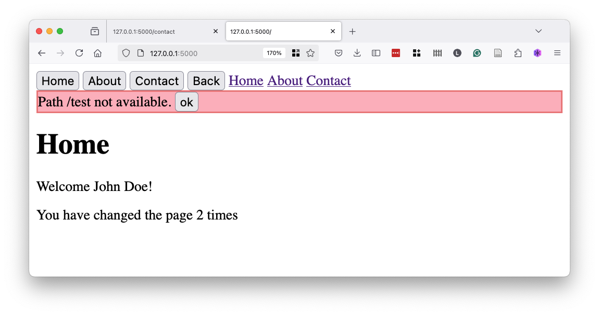

# AJAX exercise

## Exercise 1

The folder [ex_1](ex_1) contains the SPA example using the history api.
Add a `contact.js` file with a "component" that shows when the `/contact` route is used.

## Exercise 2

Update the failure handling in the `render` function in `index.html`.
If the user goes to a page that does not exist, send him back to the home page 
but also display an error message.

